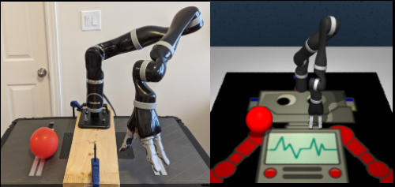

# IBIT

**Intervention Design for Effective Sim2Real Transfer** by

[Melissa Mozifian](https://melfm.github.io/about.html), [Amy Zhang](https://amyzhang.github.io/), [Joelle Pineau](https://mila.quebec/en/person/joelle-pineau/) and [David Meger](https://mila.quebec/en/person/david-meger/).

[[Paper]](TODO) [[Webpage]](https://sites.google.com/view/ibit)

<p align="center">
  
</p>

## Citation
If you use this repo in your research, please consider citing the paper as follows
```
TODO
```

## Checking out the repo with submodules
ssh
```
git clone --recurse-submodules -j8 git@github.com:melfm/simrealrep.git
```

https
```
git clone --recurse-submodules -j8 https://github.com/melfm/simrealrep.git
```

## Dependencies
The hydra dependency gets updated frequently which can potentially break the config style, the version used is `1.0.3`
```
pip install hydra-core
```
Install the third_party dependencies by running
```
bash setup_thirdparty.sh
```

## Running the code
From `ibit` dir, you can run the followings
```
cd ibit
```

```
python train.py --config_name='configs/reach_v1'
python train.py --config_name='configs/push-v1'
python train.py --config_name='configs/button-press-v1'
```

Running DBC Agent
```
python train.py --config-name='configs/reach_v1' agent.name=dbc agent.cls=agents.dbc_agent.DBCAgent
```

Running DRQ Agent
This is the default agent but in case you want the experiment ID to reflect this:
```
python train.py --config-name='configs/reach_v1' agent.name=drq agent.cls=agents.drq_agent.DRQAgent
```
Running Jaco dmsuite
```
python train.py --config-name='configs/jaco_reach_site_features' agent.name=drq agent.cls=agents.drq_agent.DRQAgent
```

Running with hyperparameter options
```
python train.py --config-name='configs/reach_v1' agent.name=deepmdp agent.cls=agents.deepmdp_agent.DeepMDPAgent penalty_type='irm' env_resample_rate=50000 num_envs=4
```

## Experiments Checklist
- Make sure the viewing camera is set correctly per env. You can change this inside `metaworld/envs/mujoco/mujoco_env.py` Line: 83 - viewer_setup()
- If you run the *same config* file twice, things will be overwritten. To avoid this, make sure you overwrite some parameters which will create experiment file with appended overwrites.

## Configurations
- apply_mod : (bool) Applies random modifications to the env (for now only visual changes)
- num_envs : (int) Number of randomized environments
- internvention : (list) `Type-1 -> ` Image Augmentation, `Type-2 -> ` Rendering changes
- penalty_type : (str) Switch between `IRM` and `REX` penalties
- agent.name : (agent) DRQ, DBC

## Rendering Issues
1) If running remotely, pass the flag
```
python train.py --remote_render=True
```
Although at the moment you still need to modify the `mujoco_env.py` `GlfwContext` instantiation. See [this](https://github.com/melfm/metaworld/blob/master/metaworld/envs/mujoco/mujoco_env.py#L21)&[this](https://github.com/melfm/metaworld/blob/master/metaworld/envs/mujoco/mujoco_env.py#L42)

2) On the host computer, export display for headless rendering and switch backend rendering engine to osmesa:
```
export DISPLAY=:0
```
and
```
MUJOCO_GL="osmesa" LD_LIBRARY_PATH=/usr/lib/x86_64-linux-gnu/nvidia-opengl/:$LD_LIBRARY_PATH
```

In general, if you notice hanging, check the rendering or check if the env is being created even. Sometimes the errors thrown from `mujoco` or `OpenGL` via metaworld are 
suppressed so you can check on the command line to see if you can import the environments and create the env.

### Debugging Errors
```
raise MujocoException('Got MuJoCo Warning: {}'.format(warn)) mujoco_py.builder.MujocoException: Got MuJoCo Warning: Nan, Inf or huge value in QACC at DOF 0.
The simulation is unstable. Time = 1.4625.
```
This happens with DeepMDP Agent or DBC, they are meant to be run with more than one env so check `num_envs` is more than 1.

### Running on the real robot
For now, hydra is slightly annoying with current file arrangement setup. Just create a symlink to jaco_physics which lives under `jaco_real` and run it from inside ibit directory.
So from ibit, run:
```
ln -s ../jaco_real/jaco_physics.py jaco_physics.py
```

# Future Work
<p align="center">
  
</p>